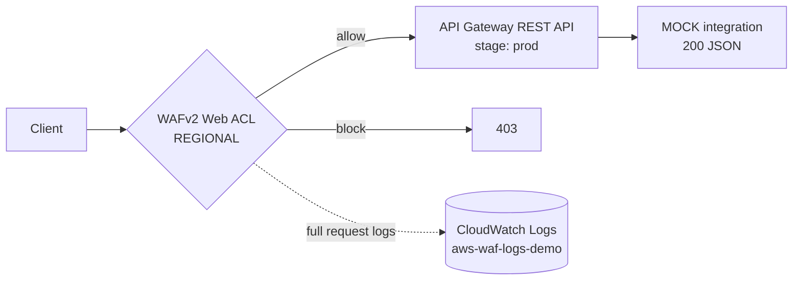

# waf-as-code

A PoC demonstrating AWS WAFv2 deployment managed entirely as code: a
regional Web ACL (managed rule groups + custom rules + rate limiting) in
front of an API Gateway endpoint, with full WAF logging, an automated
attack-simulation test suite, and a GitOps pipeline where every rule change
ships as a reviewed pull request. It demonstrates four things in one repo:
**WAF configuration**, **custom rule development** (including tuning a
managed rule that misfired), **infrastructure-as-code** (Terraform, remote
state), and **CI/CD for security config** (plan-on-PR, apply-on-merge,
OIDC — zero stored AWS keys).

## Architecture



## Rule set

| Pri | Rule | Action | Why |
|-----|------|--------|-----|
| 1 | `rate-limit-per-ip` (100 req / 5 min) | Block | Blunt-force DoS/scraper control; evaluated first so floods never reach costlier rules |
| 2 | `AWSManagedRulesCommonRuleSet` | Managed (`SizeRestrictions_BODY` → count) | Broad OWASP-style baseline; the override demonstrates tuning a noisy sub-rule without losing visibility |
| 3 | `AWSManagedRulesKnownBadInputsRuleSet` | Managed | Blocks known exploit signatures (log4j-style probes etc.) at low false-positive cost |
| 4 | `geo-match-count` (US, CA) | Count | Shows geo control in log-only mode — fires on demo traffic without breaking anything |
| 5 | `block-x-demo-attack-header` | Block | Custom rule: any request with an `x-demo-attack` header → 403; deterministic way to demo a custom block |
| 6 | `AWSManagedRulesSQLiRuleSet` | Managed | Added after the test suite caught that rules 2–3 don't inspect for SQLi — the tests earn their keep |

Every rule and the ACL itself emits CloudWatch metrics and sampled requests.

## What a block looks like

Two real (IP-redacted) log entries live in
[`docs/sample-blocked-requests.json`](docs/sample-blocked-requests.json) —
one from the custom header rule, one from the managed SQLi group:

```json
{ "terminatingRuleId": "block-x-demo-attack-header", "action": "BLOCK",
  "httpRequest": { "uri": "/prod", "headers": [{ "name": "x-demo-attack", "value": "1" }] } }
```

```json
{ "terminatingRuleId": "aws-sqli-rule-set", "terminatingRuleType": "MANAGED_RULE_GROUP",
  "action": "BLOCK", "httpRequest": { "args": "id=1%27+OR+%271%27%3d%271" } }
```

The custom-rule entry also shows the geo rule registering a COUNT in
`nonTerminatingMatchingRules` — rule 4 firing without blocking.

## Testing

```sh
tests/attack-sim.sh "$(terraform output -raw api_invoke_url)"
```

| Case | Expected |
|------|----------|
| Baseline GET | 200 |
| SQLi query string (`id=1' OR '1'='1`) | 403 (managed SQLi rules) |
| `x-demo-attack: 1` header | 403 (custom rule) |
| 150 rapid requests | 200s turning into 403s (rate rule; allow ~1–2 min of sustained traffic, and expect your IP to stay blocked a few minutes after) |

## CI/CD

```
PR opened ──► plan.yml: fmt-check → validate → tflint → terraform plan
                        └─ plan posted as a PR comment for review
merge to main ──► apply.yml: terraform apply -auto-approve
```

- Workflows authenticate via **GitHub OIDC** → an IAM role whose trust
  policy only accepts tokens from this repo. No AWS keys exist in repo
  secrets; the only stored value is the (non-secret) role ARN.
- State lives in S3 with versioning and native lockfile locking
  (`use_lockfile = true`, no DynamoDB).

### Production hardening — deliberate next steps

This is a demo optimized for "working and reviewable tonight"; before
real traffic I would:

- Replace the CI role's broad permissions with a least-privilege policy
  (wafv2/apigateway/logs + state bucket + IAM scoped to its own role)
- Add a state bucket policy (TLS-only, deny outside the CI role and admins)
- Add scheduled drift detection (nightly `terraform plan` that alerts on
  changes made outside the pipeline)
- Soak every new blocking rule in **count** mode against production
  traffic and review its metrics before flipping to block
- Pin GitHub Actions to commit SHAs and add branch protection with a
  required plan check

## Teardown

Order matters: the main stack's state lives in the bootstrap bucket, so
destroy the stack first, then the bucket.

```sh
# 1. Destroy the main stack (verified: plans 14 resources, cleanly)
terraform destroy

# 2. Destroy the state bucket (force_destroy handles versioned objects)
cd bootstrap
terraform destroy
```

Total demo cost is near zero either way: API Gateway, WAF, and CloudWatch
charges at this traffic volume are cents; the only fixed monthly cost is
the web ACL (~$5/mo + $1/rule) while it exists.
